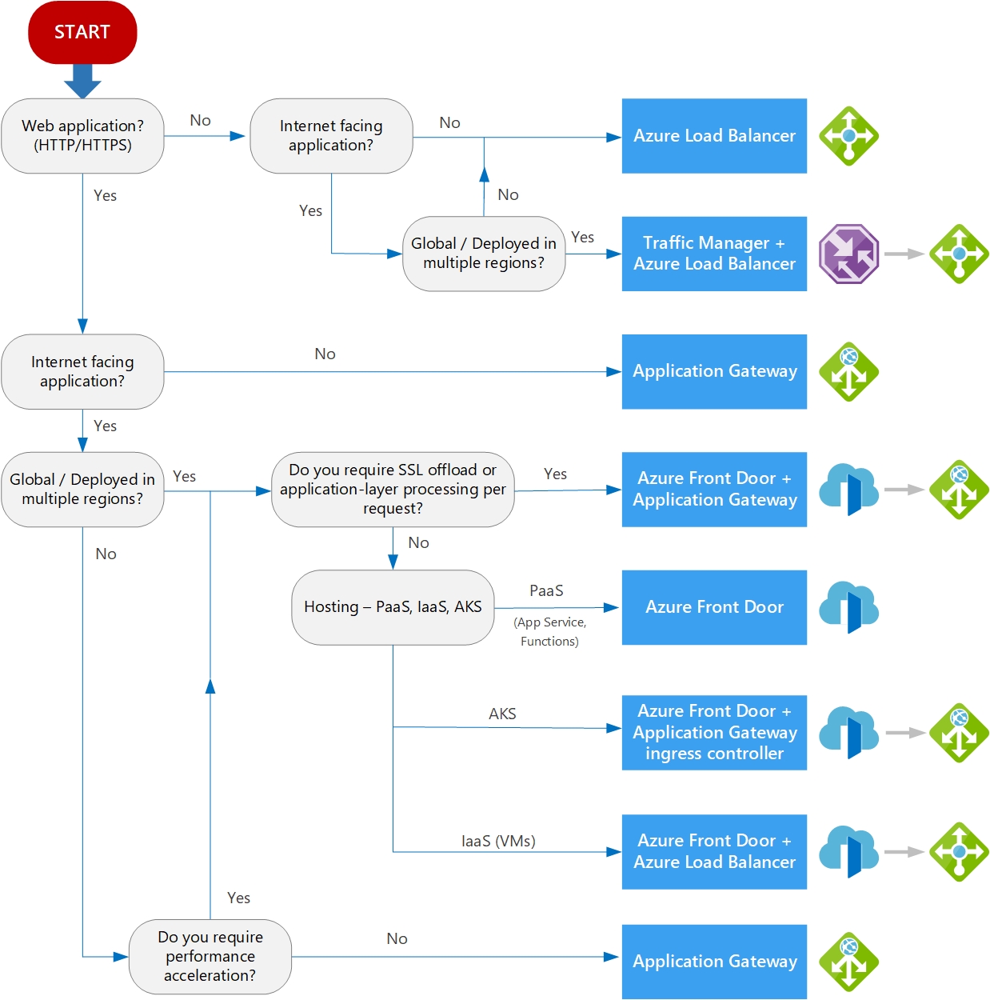

# AZ 700

- 5 IP addresses of every subnet are reserved: the first 4 + the last one
- Public IP prefixes:
  - Pull from predictable list of public IP addresses
  - Choose up to 16 addresses to be reserved that will be next to each other
  - Advantages: Whitelisting, faster creation
- VMs can communicate between subnets on the same VNET if there is no additional NSG setup

# VMs
- VMs can be attached to multiple private and public IP addresses
- Inbound ports can be specified for VMs -> will generate NSG automatically
- Availability set: Logical groupings to reduce chance of correlated failures by assigning different fault domains

# VPN
- Site-to-Site VPN:
  - Via IPsec Tunnel -> connects 2 public IP addresses on each side
  - Network gateways on each side (VPN gateway on Azure side)
  - Gateway Subnet (specific subnet) needs to be created
  - Service: Virtual network gateway (VPN device, handles also encryption/decryption)
    - Configuration
      - VPN types in Azure
        - Route-based: Route tables define where to send packets to, the tunnels themselves allow all traffic
        - Policy-based: Each VPN tunnel defines a policy of which traffic to permit
      - SKUs:
        - Basic: 10 Tunnels, no P2S OpenVPN Connections, less bandwidth, legacy SKU
        - VpnGw1-5: More tunnels, more P2S connection, more bandwidth
      - Generation:
        - 1: Less P2S connections
        - 2: More P2S connections
      - Active-active mode: 2 connections in parallel for failover
      - BGP protocol support for route-based VPNs - e.g. for Hub and Spoke models
    - Connections can bbe added with Local network gateway as target to establish VPN connection
      - Shared key (PSK) is required on each side, wwill be exchanged by IKE protocol
      - Types: VNet-to-VNet, Site-to-Site (IPsec), ExpressRoute
  - Virtual WAN should be used if you need more than 30 S2S connections
  - Local Network Gateway:
    - Representation of OnPrem gateway (pointing to OnPrem VPN gateway)
    - Configuration:
      - Endpoint: IP or FQDN
      - Define address space of Onprem network that does not overlap with Azure network
      - BGP support
- Extended networks for azure:
  - Extend Azure network with onprem network (e.g. Server cannot be moved to the cloud)
  - Alternatives should always be preferred (e.g. move server to Azure)
  - Using VXLAN tunnel between 2 Windows Server 2019 (2022 for the one in Azure) VMs that are capable of running nested virtualization
  - In Windows Admin center, there is an extension for extended networks
  - After tunnel has been established, IP addresses need to be defined that shall be extended into Azure
- Point-2-Site VPN:
  - Individuals connecting to Azure
  - A root certificate needs to be created, each client needs a certificate to connect, signed by the root cert
  - Configuration:
    - Address pool assigned to clients dynamically 
    - Root certificate public data
    - Revoked client certificates
  - VPN Client can be downloaded from Azure directly to start a connection from client side
  - Certificates public/private keys can be exported on Windows using certmgr
  - Export client cert in pfx format with private key
- Tunnel types:
  - OpenVPN
  - SSTP
  - IKEv2 (alone, with OpenVPn or with SSTP)
- Authentication types:
  - Azure certificate
  - RADIUS auth.: Required RADIUS server, can be used onprem AD and SSO
  - Azure AD

# ExpressRoute
- Onprem network connected to network provider edge location with dedicated line
- network provider has a primary/secondary dedicated connection to microsoft edge network
- Pricing based on bandwidth
- Inbound data transfer is free, unlimited data plan is available
- SKUs:
  - ER Premium to connect to all regions, otherwise only a single region
  - Standard: Connect to all regions within one geography (e.g. West Europe + France Central)
  - Local SKU: Only one Azure region in the same metro, no extra egress data transfer fee
- Global Reach: Multiple ExpressRoute connections can be connected (WAN)
- ER Direct: No network provider required, network will be connected directly with Azure network, ühysical isolation (higher security)
- Configuration via Virtual Network Gateway
  - SKUs:
    - Standard: Does not support ER + VPN together and lesss circuit connections
    - High Performance: VPN + ER
    - Ultra: Fast path, highest bandwidth
  - Can be deployed in 1-3 AZs (increased pricing)
  - Requires public IP

# Security
- Firewall vs WAF on Application Gateway:
  - WAF only filters incoming HTTPS traffic, handles Cross Site Scripting, etc.
  - Firewall also outgoing and non HTTPS traffic, more logic
  - Route table needs to be configured to route traffic through the firewall subnet - can also be setup the same way for App gateway
  - if both are configured: route inbound traffic through app gateway subnet and outbound traffic through firewall subnet
  - Azure Firewall requires its own dedicated subnet

# Service endpoints
- Need to be setup on the subnet side and on the service side that should be connected
- Better performance and latency compared to public / Azure managed network
- Increased security

# DNS
- Azure DNS Private Resolver
  - Azure private DNS records can be used OnPrem
  - Provides DNS services between On-Prem and Azure
  - Conditional forwarding -> e.g. if internet needs to be resolved, the Azure DNS Private Resolver can forward those requests to an internet DNS server
  - Inbound (from on prem to azure)/output (from azure to on prem) endpoints, latter will be forwarded to onprem DNS
- Public DNS zone
  - You can register any domain name -> Multiple Name servers of azure will be displayed
  - Azure name servers need to be configured in a domain name registrar
- Records:
  - A = Point to IPv4 address
  - CNAME = Link subdomain to another record
  - NS = Authorative name server for that domain
  - SOA = Start of Authority - stores metadata like the email address of the admin
  - Use @ sign in DNS record to refer to the standard domain name without subdomain
- Private DNS Zone:
  - No NS record
  - Needs to be linked to VNETs
  - Auto registration can be enabled -> All VMs will automatically receive a nicename

# Connecting VNETs
- VNET peering
  - Types:
    - Standard: Within the same region
    - Global: Across Azure regions
  - Traffic over Microsoft backbone network, not public internet
  - Pricing for outbount and inbound traffic even for standard VNET peering (charged twice)
  - IP ranges should not be overlapping
  - Configuration:
    - Block traffic from one direction to the other
    - Allow forwarding of traffic from one direction to the other
    - Virtual network gateway or Route server can be configured
  - Sensitive data should be encrypted -> Use network gateway
- VPN Gateway
  - Traffic over public Internet via IPSec tunnel
  - Slower, different pricing (inbound is free)
- Network gateway

# WAN
- Hub & Spoke:
  - All network connect to one hub, instead of connecting all networks to each other
- Virtual WAN:
  - Types:
    - Basic: Only VPN S2S
    - Standard: ExpressrRoute, all VPN options, VNET-to-VNET, etc.
  - Pricing:
    - Per hour, per GB of use, bandwidth dependent, per connection
  - Hub:
    - Has its own network private address space
    - Can create gatewways for VPN S2S/P2S and ExpressRoute
    - Options for traffic to tracel accross Microsoft network as long as possible before it enters public internet
  - VPN Sites:
    - Similar to local network gateway for the Virtual WAN
    - Links can be added for the actual VPN Gateway OnPrem: IP address, BPG address, ASN number, Link speed etc. need to be entered
    - After creating the link, the site needs to be connected:
      - Pre-shared key can be entered, protocol and routing options can be selected
  - Virtual network connections:
    - VNETs can be selected and route table assigned

# Routing
- System routes: Default set of routes
  - Routing within the VNET
  - 0.0.0.0/0 -> Internet
- VNet ppering, Virtual network gateway, Service Endpoints -> Will add routes to the system route table
- Route tables can be created / assigned per subnet
- IP forwarding needs to be enabled on the NIC and within the OS to allow the device receiving traffic that is sent to a different IP 
- Forced tunnel: Go through VPN tunnel instead of going directly to the internet
  - Frontend still can route directly to the internet, but mid-tier and backend should be routed through OnPrem for increased security

# Load Balancing

## Load Balancer
- Basic tier is free
  - Up to 300 instances
  - VMs in a single availability set or a VMSS
  - Health probes (TCP, HTTP)
  - Does NOT support: Multiple AZs, high Availability, HTTPS health probes, optional NSG, no SLAs
- Standard tier:
  - Up to 1.000 instances
  - Any VM, any VMSS in a single VNet
  - HTTPS health probe, multi AZ, high availability (for internal LB), 99,99% SLA supported
  - NSG is required
- Public vs. internal/private LBs
- Layer 4 (transport)
- High availability through global load balancer that can balance regional LBs
- Multiple IPs can be connected to the same LB
- Health probes need to be added manually:
  - HTTP GET to a specific path (check for 200 response) or TCP with interval and unhealthy threshold
- Only supports balancing traffic inside a single VNet
- Load balancing rules:
  - Specify protocol, port and FE IP
  - Port can be changed while routing
  - Session persistence can be set (always route to the same server within the same session), idle timeout for sessions can be set
  - Floating IP: To reach the same port on the same VM multiple times (requires multiple NICs)
- Good use case in front of IaaS (VMs)

## Application Gateway
  - Layer 7 (application) -> URLs, paths, etc.
  - Limited to HTTP/web traffic
  - Optionally includes WAF
  - Supports load balancing across different AZs and VNets within a single region
  - Can be used with AKS as Application GW Ingress Controller
  - SKUs: Standard or with WAF
  - Autoscaling options for the Gateway itself
  - Supports public/private or both IP configs for Frontend
  - Supports other services in addition to azure VMs (compared to Load Balancer): App Services, IP addresses, FQDNs
  - Routing rules:
    - HTTP/HTTPS traffic only
    - Multi-site to register more web applications on the same port (e.g. with different FQDNs)
    - Cookie-based affinity to root based on cookies to the same target server
    - Connection draining: When server gets shutdown, wait until there is no more traffic 
    - Backend paths and host names can be overriden
    - Path-based routing rules
  - HTTP headers can be rewritten
    - Associated with routing rules
    - Conditions and priorities can be added
    - Can modify request and response headers
    - URLs can be also rewritten, e.g. to respond with a different API path than the actual server
  - Manual and autoscaling options (min. 2 instances) for app gateway itself
  - WAF modes: Detection (without any actions) vs. Prevention

## Traffic Manager
  - DNS based global routing between regions -> e.g. closed geographically routing
  - Automatic failover when one region goes down
  - Not only limited to web traffic
  - Similar to Front Door, but without caching, WAF, etc. -> only routing
  - Config:
    - DNS name with suffix trafficmanager.net (CNAME can be used)
    - Routing methods: Performance, Weighted (% based), Priority (All traffic to one location as long as available), Geographic, MultiValue (Return all IPs for a given DNS), Subnet (CIDR)
  - Possible endpoints: Azure (either choose service or public ip), External, Nested (another traffic manager (e.g. first geographic, then performance))

## Azure Front Door
  - Global load balancing
  - Frontend config:
    - host name with azurefd.net suffic -> CNAME to redirect own DNS
  - Backend config:
    - Supports also Storage Accounts, Application Gateway, API Management, Traffic Manager
    - Health probes (HTTP or HTTPS)
  - Routing:
    - Path-based, URL rewrite
    - Forward vs. Redirect (change URL)
  - Caching feature for static content and dynamic compression to enhance performance
    - Cache can be purged on demand
  - Offers session affinity and WAF features
  - Layer 7 (application)
  - Optionally includes WAF, caching and app acceleration features
  - Support SSL offloading
  - Good use case in front of PaaS (Functions, App Service, etc.)

# Bookmark
- Abschnitt 11 - LAB

# Todos
- Service endpoint policies?
- Network address calculation
- Virtual network gateway or route server for VNET peering
- ASN number?
- Check what route tables are created through the Virtual WAN for VNETs
- Traffic manager + Front door